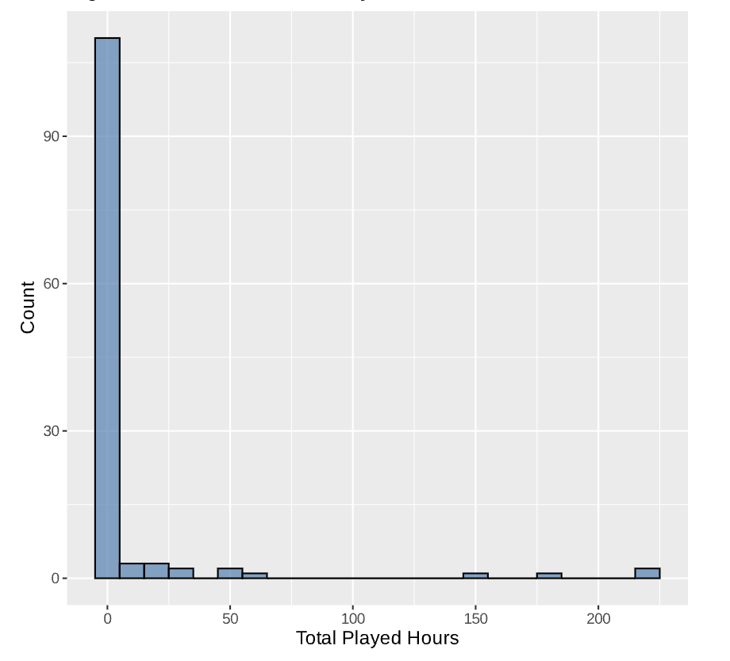
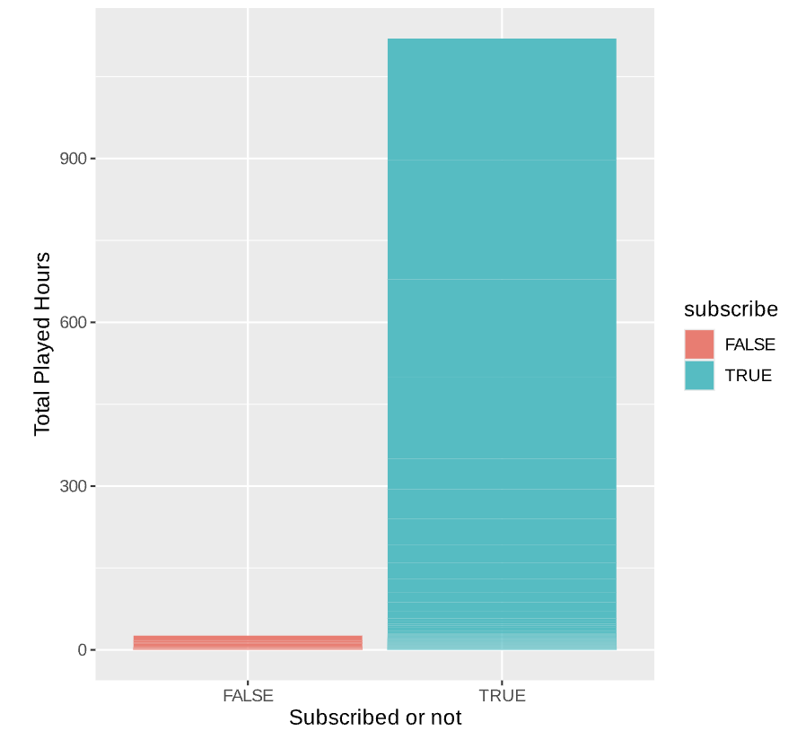
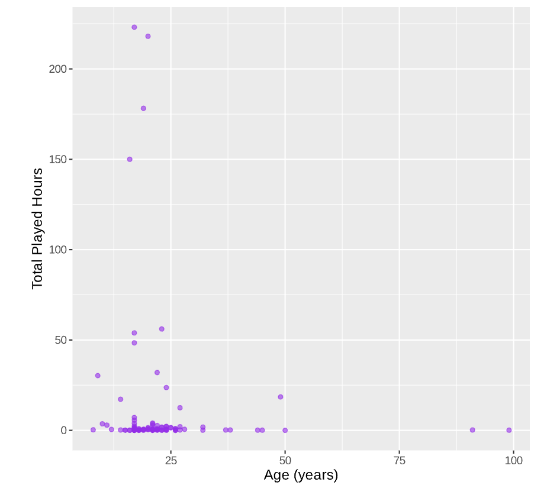
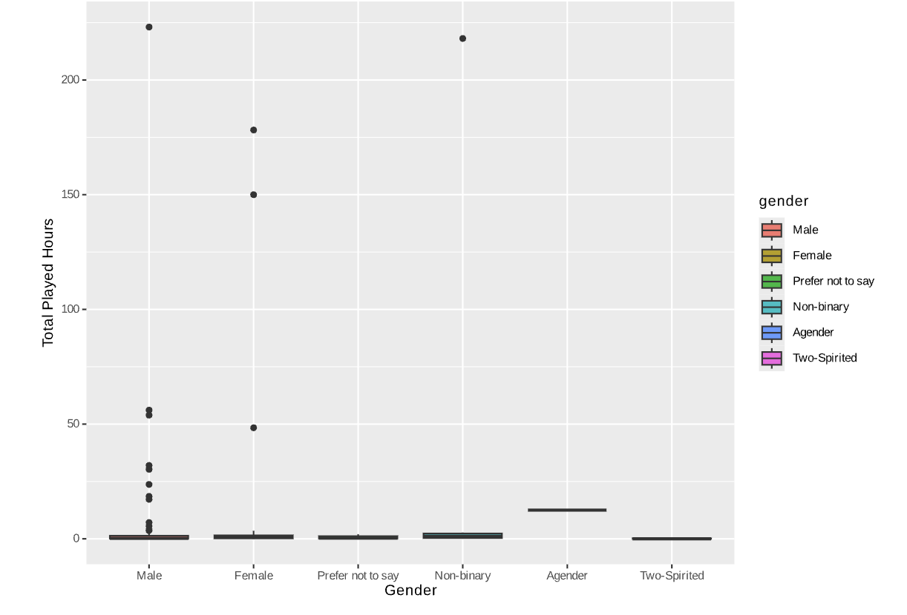
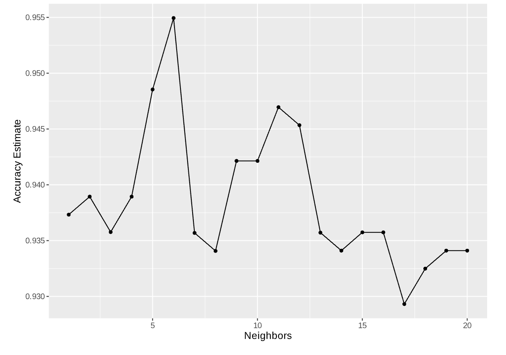
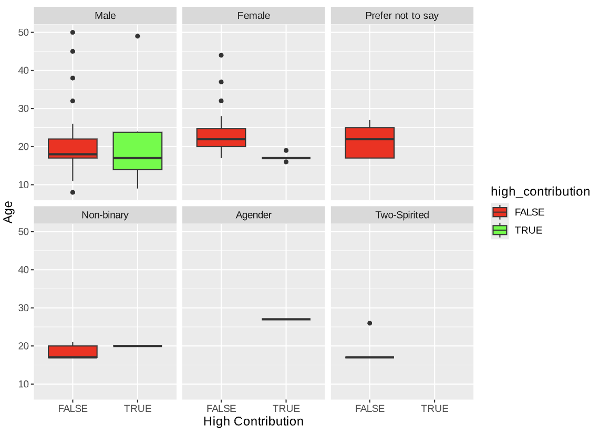

# Predicting High Data Contributors in Minecraft

A team of researchers are trying to understand how players behave on a [Minecraft server](https://plaicraft.ai/). They want to know: *Who are the players most likely to contribute a lot of data?* This is an important question for managing server resources and planning player recruitment efforts, as knowing which players are most active, i.e., contributed more total played hours, helps the team prepare for the right level of engagement. 

## Our Data: Who Are These Players?

To do this, I used two main datasets:

- **Players Data**: This dataset contains information about each player. Some of the key details include:
  - `experience`: How experienced the player is (e.g., "Amateur," "Regular").
  - `subscribe`: Whether or not the player signed up for email updates from the server.
  - `gender`: The player’s gender.
  - `played_hours`: Total hours the player has spent playing the game.
  - `age`: How old the player is.

- **Sessions Data**: This dataset records the details of every session a player has. For example:
  - `start_time` and `end_time`: When the player started and finished their session.
  - `original_start_time` and `original_end_time`: Numeric timestamps used to calculate the session’s duration.

### Data Cleaning and Wrangling

Before jumping into the analysis, I wrangled and combined two datasets to create a condensed and useful dataset, including dropping irrelevant Data like `individualId` and `organizationName` columns as all of them are `NA`, summing up total playtime from the `Sessions` dataset and compared to the `played_hours` in the `Players` dataset, etc.

## Exploratory Data Analysis(EDA)

EDA revealed some interesting insights, including the distribution of playtime and key demographic patterns among the players.

1. **Playtime Distribution**: The histogram below (Figure 1) shows how the playtime is spread out across all players. Most players didn’t play/contribute much, but a small group of players played for lots of hours. It was a pretty classic "long-tail" distribution—few players contribute a lot, while most contribute just a little. 
    
   *Figure 1: Distribution of Total Playtime*  

2. **Demographics Matter**: I also explored how different player demographics (like age, gender, and experience) affected their playtime:
   - **Experience**: Players who called themselves "Amateurs" or "Regulars" tended to log more hours. This was a bit of a surprise, as I might expect the more experienced "Veterans" or "Pros" to play more. But it turns out that experience isn’t always the biggest factor.
   - **Subscription**: As the bar chart for distribution of total played hours among subscription (Figure 2) shown below: players who signed up for email updates played significantly more than those who didn’t. This suggests that email engagement might lead to higher playtime. 
    
   *Figure 2: Total Playtime by subscription*
   - **Age**: Younger players (under 30) appears to contribute more data, as the scatter plot (Figure 3) shown below. 
    
   *Figure 3: Total Playtime by Age*
   - **Gender**: Also, male players contributed more data/played more hours according to the distribution plot below, however, I wonder it could be due to the dataset has more data records associated with male player, that is, there could be imbalance in the original dataset 
    
   *Figure 4: Total Playtime by Gender*  

## The Model: Predicting High Contributors with KNN

Now, the fun part: using a machine learning model to predict which players will be the biggest contributors. I used **K-Nearest Neighbors (KNN)** classification model, which is like saying, "If a player is similar to other players in terms of age, experience, gender, and sessions played, they will probably contribute a similar amount of playtime."

1. **Data Preprocessing and feature engineering**: I created a binary target column `high_contribution` for KNN classification, based on the threshold (the mean of `played_hours`). Meanwhile, I found out the original dataset are quite imbalanced, so I [upsampled](https://search.r-project.org/CRAN/refmans/groupdata2/html/upsample.html), the dataset based on gender and target, i.e., balanced the dataset so that each gender has almost equal number of data rows, and same for the target feature that we want to predict on.
2. **Choosing "K"**: The KNN classification model requires choosing the number of neighbors (`K`) to compare each player to, so I tuned and trained the model using a range of Ks. And as the line graph shows below, it appeared that `k = 6` worked best as it gave the best accuracy for a trained KNN model. 
    
   *Figure 5: Accuracies vs. Number of neighbors (K)*
3. **Prediction**: After training the model, I checked its performance with a test dataset that was split and put aside for evaluation, and the KNN model was able to predict high contributors with 97% recall accuracy, meaning 97 out of 100 the true highly contributive players are predicted correctly.

## Results
The model pretty much confirmed what I expected: "Amateur" and "Regular" players were the biggest contributors, while "Veterans" and "Pros" didn’t play as much as I thought they would. I also found that players who signed up for email updates played more, so those little nudges really seem to do the trick! It turns out younger players, especially in their teens and early twenties, were the most active, with young males leading the way, as you can see in the box plot below.
     
   *Figure 6: Accuracies vs. Number of neighbors (K)*

## Caveats: Things to Keep in Mind

While the results are interesting, there are a few things we need to be cautious about:

1. *Class Imbalance*: Most players contribute very little data, and there is also imbalance among gender and ages, so the model might be biased. I tried to balance this, but it’s still something to watch out for.
2. *Missing Data*: Some players' information was incomplete. I removed those rows, but I might have lost useful insights about why they contribute less.
3. *Arbitrary Threshold*: I defined "high contributors" based on the average total playtime, but this is somewhat arbitrary, there could be other approaches, like the played hours in one single session.

## To conclude

From this analysis, I learned that **younger players** and those with **amateur or regular experience levels** are most likely to contribute significant data. This is useful information for the research team to help them target the right players for future studies. However, I were surprised by the low contribution from more experienced players, and I still have a lot of questions to explore—like how can we improve engagement with more experienced players, and how will engagement change as the proportion of female players increases?
